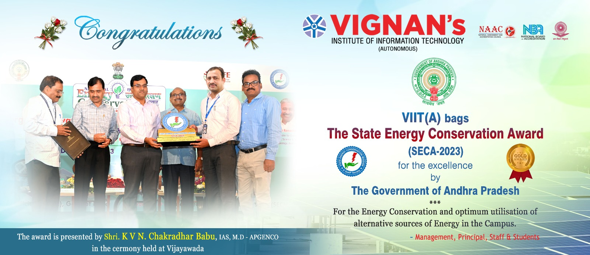
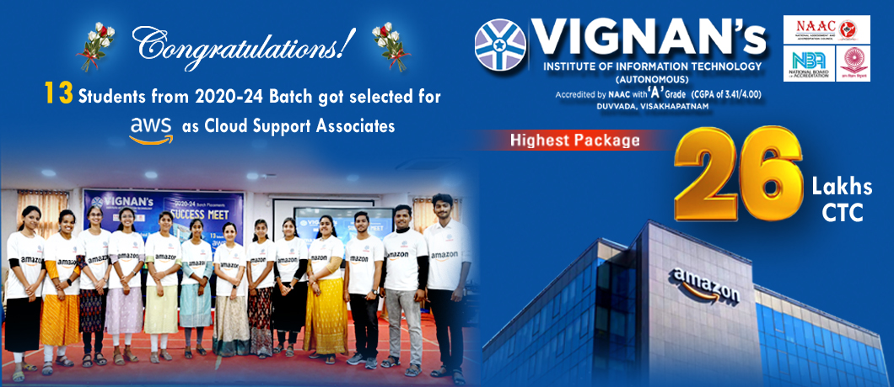
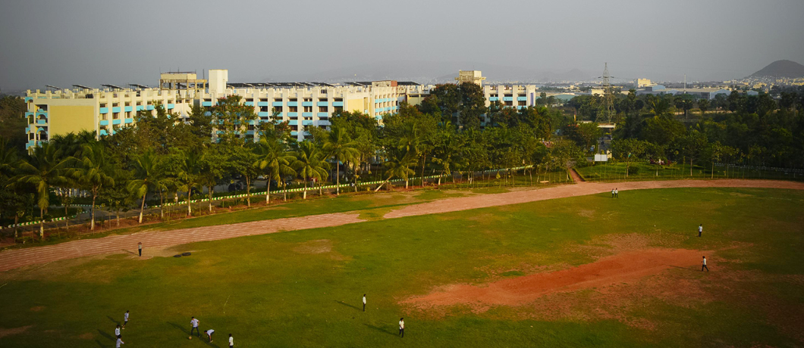
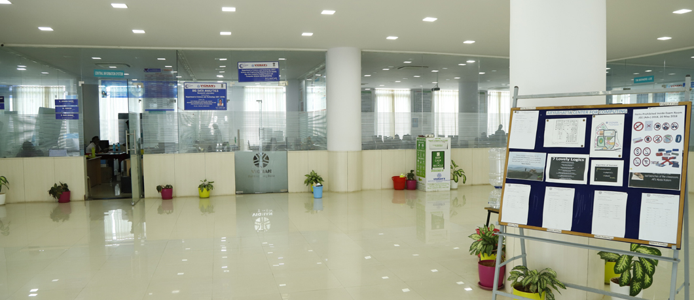
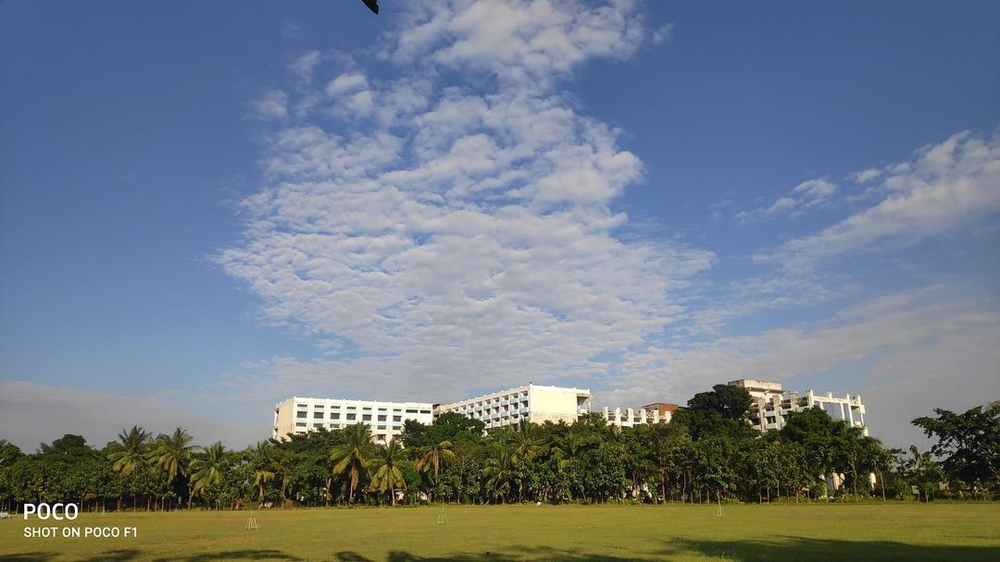

# Exercise 1

<div>Table of Contents</div>
<a href"#1">Home Page</a>
<a href"#2">Login Page</a>
<a href"#3">Registration Page</a>
<a href"#4">About Institution Page</a>

<h2 id="1">Home Page</h2>
<div align="center">
    
</div>

```html
<!DOCTYPE html>
<html lang="en">
<head>
    <meta charset="UTF-8" />
    <meta name="viewport" content="width=device-width, initial-scale=1.0" />
    <meta http-equiv="X-UA-Compatible" content="ie=edge" />
    <title>Educational Institution | Home</title>
    <link rel="stylesheet" href="styles.css">
</head>
<body>
    <header>
        <div>Vignan's IIT | Visakhapatnam</div>
        <ul class="h_items">
            <a href="/aicte">AICTE</a>
            <a href="/ugc">UGC</a>
            <a href="/nba">NBA</a>
            <a href="/naac">NAAC</a>
            <a href="/nirf">NIRF</a>
            <a href="/e-gov">e-Gov</a>
            <a href="/ecap">ECAP</a>
            <a href="/v-wms">V-WMS</a>
            <a href="/feedback"><span>*</span> Stakeholders - feedback</a>
        </ul>
        <div class="hero_img"></div>
    </header>
    <nav class="nav">
        <div>About Institution</div>
        <ul class="nav_items">
            <a href="/about">About Us ▾</a>
            <a href="/governance">Governance ▾</a>
            <a href="/academics">Academics ▾</a>
            <a href="/departments">Departments ▾</a>
            <a href="/placements">Placements ▾</a>
            <a href="/examinations">Examinations ▾</a>
            <a href="/facilities">Facilities ▾</a>
            <a href="/campus-life">Campus Life ▾</a>
            <a href="/cells">Cells ▾</a>
        </ul>
    </nav>
    <main>
        <div class="latest_news">
            <span>Latest News</span><span>Congratulations to all Stakeholders of Vignan's Institute of
                Information Technology for acheiving NIRF India ranking 2024 in 201-300 rank band engineering
                category</span> |
            <span>We are proud to announce that Vignan's Institute of Information Technology has been re-accredited by
                NAAC with A+
                grade(3.41/4.00 cgpa)cycle-III</span>
        </div>
        <div class="carousel">
            <div>
                <div></div>
                <div></div>
                <div></div>
                <div></div>
                <div></div>
            </div>
        </div>
        <div class="hero_section">
            <div>
                <div>Welcome to VIIT</div>
                <iframe class="aspect-video rounded-lg w-full h-fit"
                    src="https://www.youtube.com/embed/sq8ISpdiaLc?si=TkaOLra6esEQUZgm" title="YouTube video player"
                    frameborder="0"
                    allow="accelerometer; autoplay; clipboard-write; encrypted-media; gyroscope; picture-in-picture; web-share"
                    referrerpolicy="strict-origin-when-cross-origin" allowfullscreen>
                </iframe>
            </div>
            <div>
                <div>About VIIT</div>
                <div>Vignan's Institute of Information Technology (VIIT)
                    was established in 2002 in the City of Destiny, Visakhapatnam, to cater to the educational needs of
                    the general public. It acquired Autonomous status in the year 2017 and NBA and NAAC(A Grade)
                    accredited Institute. The experience gained by Vignan through its earlier institutions at Guntur has
                    only helped in establishing very high quality standards right from the inception and also is one of
                    the reasons for the success.</div>
            </div>
            <div>
                <div>Chairman's Message</div>
                <div>
                    <div>
                        
                        <div>Well Thought-out Reforms In Technical Education Is The Need Of The Hour "We, in India
                            today, are living in a transitional era.</div>
                    </div>
                    <div class="text-sm text-end text-blue-500 hover:text-blue-600"><a href="#" class="">Read more</a></div>
                </div>
            </div>
        </div>
        </div>
    </main>
</body>
</html>
```

<h2 id="2">Login Page</h2>
<div align="center">
    
</div>

```html
<!DOCTYPE html>
<html lang="en">
<head>
    <meta charset="UTF-8" />
    <meta name="viewport" content="width=device-width, initial-scale=1.0" />
    <meta http-equiv="X-UA-Compatible" content="ie=edge" />
    <title>Educational Institution | Login</title>
    <link rel="stylesheet" href="styles.css">
</head>
<body>
    <header>
        <div>Vignan's IIT | Visakhapatnam</div>
        <ul class="h_items">
            <a href="/aicte">AICTE</a>
            <a href="/ugc">UGC</a>
            <a href="/nba">NBA</a>
            <a href="/naac">NAAC</a>
            <a href="/nirf">NIRF</a>
            <a href="/e-gov">e-Gov</a>
            <a href="/ecap">ECAP</a>
            <a href="/v-wms">V-WMS</a>
            <a href="/feedback"><span>*</span> Stakeholders - feedback</a>
        </ul>
    </header>
    <main class="login_page">
        <div>
            
            <div>Vignan Institute of Information Technology</div>
        </div>
        <div class="login_card">
            <div class="clg_title">
                
                <span>Vignan IIT</span>
            </div>
            <div>Welcome Back</div>
            <div class="select_user">
                <button>Student</button>
                <button>Faculty</button>
                <button>Alumni</button>
                <button>Parent</button>
            </div>
            <form action="validateForm(event)" method="POST" class="login_form">
                <div>
                    <label for="email">Email</label>
                    <input type="email" id="email" name="email" placeholder="Enter your email">
                </div>
                <div>
                    <label for="password">Password</label>
                    <input type="password" id="password" name="password" placeholder="Enter your password">
                </div>
                <div>
                    <label>
                        <input type="checkbox">
                        <span>Remember Me</span>
                    </label>
                    <a href="#">Forgot Password?</a>
                </div>
                <div class="login_btn"><button type="submit">Login</button></div>
            </form>
            <div>
                <p>Don't have an account? <a href="/signup">Sign Up</a></p>
                <div>
                    <a href="/terms">Terms of Service</a>
                    <a href="/privacy">Privacy Policy</a>
                </div>
            </div>
        </div>
    </main>
</body>
</html>
```

<h2 id="3">Registration Page</h2>
<div align="center">
    
</div>

```html
<!DOCTYPE html>
<html lang="en">
<head>
    <meta charset="UTF-8" />
    <meta name="viewport" content="width=device-width, initial-scale=1.0" />
    <meta http-equiv="X-UA-Compatible" content="ie=edge" />
    <title>Educational Institution | Sign Up</title>
</head>
<body>
    <header>
        <div>Vignan's IIT | Visakhapatnam</div>
        <ul class="h_items">
            <a href="/aicte">AICTE</a>
            <a href="/ugc">UGC</a>
            <a href="/nba">NBA</a>
            <a href="/naac">NAAC</a>
            <a href="/nirf">NIRF</a>
            <a href="/e-gov">e-Gov</a>
            <a href="/ecap">ECAP</a>
            <a href="/v-wms">V-WMS</a>
            <a href="/feedback"><span>*</span> Stakeholders - feedback</a>
        </ul>
    </header>
    <main class="registration_page">
        <div>
            
            <div>Vignan Institute of Information Technology</div>
        </div>
        <div class="registration_card">
            <div class="clg_title">
                
                <span>Vignan IIT</span>
            </div>
            <div>Create an Account</div>
            <form action="validateForm(event)" method="POST" class="signup_form">
                <div>
                    <label for="full-name">Full Name</label>
                    <input type="text" id="full-name" name="full-name" placeholder="Enter your full name" required>
                </div>
                <div>
                    <label for="email">Email</label>
                    <input type="email" id="email" name="email" placeholder="Enter your email" required>
                </div>
                <div>
                    <label for="phone">Phone Number (optional)</label>
                    <input type="tel" id="phone" name="phone" placeholder="Enter your phone number">
                </div>
                <div>
                    <label for="password">Password</label>
                    <input type="password" id="password" name="password" placeholder="Enter your password" required>
                </div>
                <div>
                    <label for="confirm-password">Confirm Password</label>
                    <input type="password" id="confirm-password" name="confirm-password" placeholder="Confirm your password" required>
                </div>
                <div>
                    <label for="role">Role</label>
                    <select id="role" name="role" required>
                        <option value="student">Student</option>
                        <option value="faculty">Faculty</option>
                        <option value="alumni">Alumni</option>
                        <option value="parent">Parent</option>
                    </select>
                </div>
                <div class="submit_btn">
                    <button type="submit">Register</button>
                </div>
            </form>
            <div>
                <p>Already have an account?<a href="/login">Login</a></p>
                <div><a href="/terms">Terms of Service</a><a href="/privacy">Privacy Policy</a></div>
            </div>
        </div>
    </main>
</body>
</html>
```

<h2 id="4">About Institution Page</h2>
<div align="center">
    
</div>

```html
<!DOCTYPE html>
<html lang="en">
<head>
    <meta charset="UTF-8" />
    <meta name="viewport" content="width=device-width, initial-scale=1.0" />
    <meta http-equiv="X-UA-Compatible" content="ie=edge" />
    <title>Educational Institution | Home</title>
    <link rel="stylesheet" href="styles.css">
</head>
<body>
    <header>
        <div>Vignan's IIT | Visakhapatnam</div>
        <ul class="h_items">
            <a href="/aicte">AICTE</a>
            <a href="/ugc">UGC</a>
            <a href="/nba">NBA</a>
            <a href="/naac">NAAC</a>
            <a href="/nirf">NIRF</a>
            <a href="/e-gov">e-Gov</a>
            <a href="/ecap">ECAP</a>
            <a href="/v-wms">V-WMS</a>
            <a href="/feedback"><span>*</span> Stakeholders - feedback</a>
        </ul>
    </header>
    <nav class="nav">
        <div>About Institution</div>
        <ul class="nav_items">
            <a href="/about">About Us ▾</a>
            <a href="/governance">Governance ▾</a>
            <a href="/academics">Academics ▾</a>
            <a href="/departments">Departments ▾</a>
            <a href="/placements">Placements ▾</a>
            <a href="/examinations">Examinations ▾</a>
            <a href="/facilities">Facilities ▾</a>
            <a href="/campus-life">Campus Life ▾</a>
            <a href="/cells">Cells ▾</a>
        </ul>
    </nav>
    <main>
        <div class="latest_news">
            <span>Latest News</span><span>Congratulations to all Stakeholders of Vignan's Institute of
                Information Technology for acheiving NIRF India ranking 2024 in 201-300 rank band engineering
                category</span> |
            <span>We are proud to announce that Vignan's Institute of Information Technology has been re-accredited by
                NAAC with A+
                grade(3.41/4.00 cgpa)cycle-III</span>
        </div>
        <div class="carousel">
            <div>
                <div></div>
                <div></div>
                <div></div>
                <div></div>
                <div></div>
            </div>
        </div>
        <div class="hero_section">
            <div>
                <div>Welcome to VIIT</div>
                <iframe class="aspect-video rounded-lg w-full h-fit"
                    src="https://www.youtube.com/embed/sq8ISpdiaLc?si=TkaOLra6esEQUZgm" title="YouTube video player"
                    frameborder="0"
                    allow="accelerometer; autoplay; clipboard-write; encrypted-media; gyroscope; picture-in-picture; web-share"
                    referrerpolicy="strict-origin-when-cross-origin" allowfullscreen>
                </iframe>
            </div>
            <div>
                <div>About VIIT</div>
                <div>Vignan's Institute of Information Technology (VIIT)
                    was established in 2002 in the City of Destiny, Visakhapatnam, to cater to the educational needs of
                    the general public. It acquired Autonomous status in the year 2017 and NBA and NAAC(A Grade)
                    accredited Institute. The experience gained by Vignan through its earlier institutions at Guntur has
                    only helped in establishing very high quality standards right from the inception and also is one of
                    the reasons for the success.</div>
            </div>
            <div>
                <div>Chairman's Message</div>
                <div>
                    <div>
                        
                        <div>Well Thought-out Reforms In Technical Education Is The Need Of The Hour "We, in India
                            today, are living in a transitional era.</div>
                    </div>
                    <div class="text-sm text-end text-blue-500 hover:text-blue-600"><a href="#" class="">Read more</a></div>
                </div>
            </div>
        </div>
        </div>
    </main>
</body>
</html>
```
