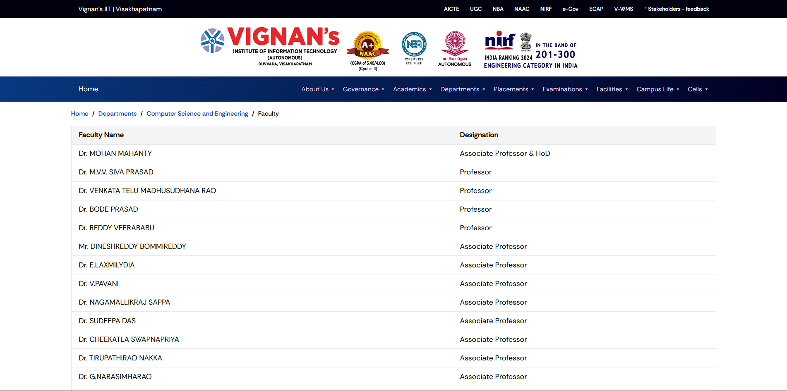
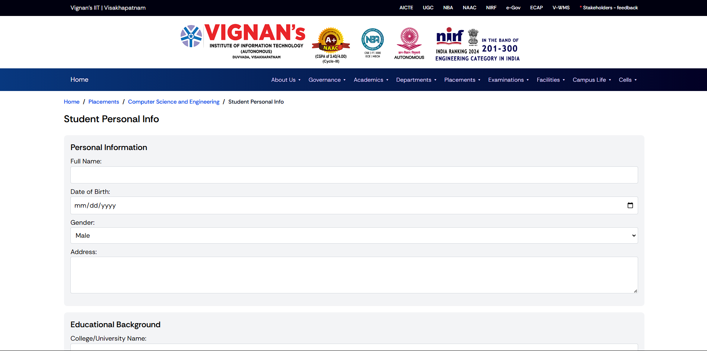

# Exercise 2

**Table of Contents**
[Departments Faculty Details Page](#1)
[Student Personal Info Placement Staff Details Page](#2)

<h2 id="1">Departments Faculty Details Page</h2>
<div align="center">
    
</div>

```html
<!DOCTYPE html>
<html lang="en">
<head>
    <meta charset="UTF-8" />
    <meta name="viewport" content="width=device-width, initial-scale=1.0" />
    <meta http-equiv="X-UA-Compatible" content="ie=edge" />
    <title>Educational Institution | Home</title>
    <link rel="stylesheet" href="styles.css">
</head>
<body>
    <header>
        <div>Vignan's IIT | Visakhapatnam</div>
        <ul class="h_items">
            <a href="/aicte">AICTE</a>
            <a href="/ugc">UGC</a>
            <a href="/nba">NBA</a>
            <a href="/naac">NAAC</a>
            <a href="/nirf">NIRF</a>
            <a href="/e-gov">e-Gov</a>
            <a href="/ecap">ECAP</a>
            <a href="/v-wms">V-WMS</a>
            <a href="/feedback"><span>*</span> Stakeholders - feedback</a>
        </ul>
        <div class="hero_img"></div>
    </header>
    <nav class="nav">
        <div>About Institution</div>
        <ul class="nav_items">
            <a href="/about">About Us ▾</a>
            <a href="/governance">Governance ▾</a>
            <a href="/academics">Academics ▾</a>
            <a href="/departments">Departments ▾</a>
            <a href="/placements">Placements ▾</a>
            <a href="/examinations">Examinations ▾</a>
            <a href="/facilities">Facilities ▾</a>
            <a href="/campus-life">Campus Life ▾</a>
            <a href="/cells">Cells ▾</a>
        </ul>
    </nav>
    <main class="faculty_page">
        <div class="breadcrumb">
            <a href="#">Home</a><span>/</span>
            <a href="#">Departments</a><span>/</span>
            <a href="#">Computer Science and Engineering</a><span>/</span>
            <span>Faculty</span>
        </div>
        <table class="faculty_details">
            <thead>
                <tr>
                    <th>Faculty Name</th>
                    <th>Designation</th>
                </tr>
            </thead>
            <tbody>
                <tr>
                    <td>Dr. MOHAN MAHANTY</td>
                    <td>Associate Professor & HoD</td>
                </tr>
                <tr>
                    <td>Dr. M.V.V. SIVA PRASAD</td>
                    <td>Professor</td>
                </tr>
                <tr>
                    <td>Dr. VENKATA TELU MADHUSUDHANA RAO</td>
                    <td>Professor</td>
                </tr>
                <tr>
                    <td>Dr. BODE PRASAD</td>
                    <td>Professor</td>
                </tr>
                <tr>
                    <td>Dr. REDDY VEERABABU</td>
                    <td>Professor</td>
                </tr>
                <tr>
                    <td>Mr. DINESHREDDY BOMMIREDDY</td>
                    <td>Associate Professor</td>
                </tr>
                <tr>
                    <td>Dr. E.LAXMILYDIA</td>
                    <td>Associate Professor</td>
                </tr>
            </tbody>
        </table>
    </main>
</body>
</html>
```

<h2 id="2">Student Personal Info Placement Staff Details Page</h2>
<div align="center">
    
</div>

```html
<!DOCTYPE html>
<html lang="en">
<head>
    <meta charset="UTF-8" />
    <meta name="viewport" content="width=device-width, initial-scale=1.0" />
    <meta http-equiv="X-UA-Compatible" content="ie=edge" />
    <title>Educational Institution | Student Details</title>
</head>
<body>
    <header>
        <div>Vignan's IIT | Visakhapatnam</div>
        <ul class="h_items">
            <a href="/aicte">AICTE</a>
            <a href="/ugc">UGC</a>
            <a href="/nba">NBA</a>
            <a href="/naac">NAAC</a>
            <a href="/nirf">NIRF</a>
            <a href="/e-gov">e-Gov</a>
            <a href="/ecap">ECAP</a>
            <a href="/v-wms">V-WMS</a>
            <a href="/feedback"><span>*</span> Stakeholders - feedback</a>
        </ul>
        <div class="hero_img"></div>
    </header>
    <nav class="nav">
        <div>About Institution</div>
        <ul class="nav_items">
            <a href="/about">About Us ▾</a>
            <a href="/governance">Governance ▾</a>
            <a href="/academics">Academics ▾</a>
            <a href="/departments">Departments ▾</a>
            <a href="/placements">Placements ▾</a>
            <a href="/examinations">Examinations ▾</a>
            <a href="/facilities">Facilities ▾</a>
            <a href="/campus-life">Campus Life ▾</a>
            <a href="/cells">Cells ▾</a>
        </ul>
    </nav>
    <main>
        <div class="breadcrumb">
            <a href="/home">Home</a><span>/</span>
            <a href="/placements">Placements</a><span>/</span>
            <a href="/cse">Computer Science and Engineering</a><span>/</span>
            <span>Student Personal Info</span>
        </div>
        <h1>Student Personal Info</h1>
        <form class="student_form">
            <div class="details">
                <h2>Personal Information</h2>
                <label>
                    Full Name:
                    <input type="text" name="fullName" required>
                </label>
                <label>
                    Date of Birth:
                    <input type="date" name="dob" required>
                </label>
                <label>
                    Gender:
                    <select name="gender">
                        <option value="male">Male</option>
                        <option value="female">Female</option>
                        <option value="other">Other</option>
                    </select>
                </label>
                <label>
                    Address:
                    <textarea name="address" rows="3" required></textarea>
                </label>
            </div>
            <div class="edu">
                <h2>Educational Background</h2>
                <label>
                    College/University Name:
                    <input type="text" name="university" required>
                </label>
                <label>
                    Degree:
                    <input type="text" name="degree" required>
                </label>
                <label>
                    Branch/Specialization:
                    <input type="text" name="branch" required>
                </label>
                <label>
                    Graduation Year:
                    <input type="number" name="gradYear" required>
                </label>
                <label>
                    CGPA/Percentage:
                    <input type="text" name="cgpa" required>
                </label>
            </div>
            <div class="student_skills">
                <h2>Skills</h2>
                <label>
                    Technical Skills (e.g., Java, Python):
                    <input type="text" name="techSkills" required>
                </label>
                <label>
                    Soft Skills (e.g., Communication, Leadership):
                    <input type="text" name="softSkills">
                </label>
                <label>
                    Certifications (if any):
                    <textarea name="certifications" rows="2"></textarea>
                </label>
            </div>
            <div class="contact_details">
                <h2>Contact Information</h2>
                <label>
                    Email:
                    <input type="email" name="email" required>
                </label>
                <label>
                    Phone Number:
                    <input type="tel" name="phone" required>
                </label>
                <label>
                    LinkedIn Profile:
                    <input type="url" name="linkedin">
                </label>
                <label>
                    GitHub Profile:
                    <input type="url" name="github">
                </label>
            </div>
            <button type="submit" class="submit_btn">
                Submit
            </button>
        </form>
    </main>
</body>
</html>
```
